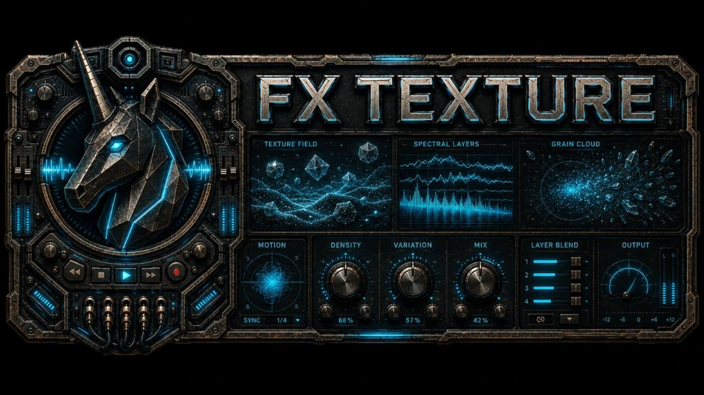

# DAW Core / Unicor SoundEngine

  

  <strong>Music software showcase for two separate lines: DAW Core, a browser-based web local-first DAW, and Unicor SoundEngine for Synthé, FX, and VST distribution.</strong>

  <a href="#english">English</a> ·
  <a href="#francais">Francais</a> ·
  <a href="docs/one-pager.md">One-pager</a> ·
  <a href="docs/project-map.md">Project map</a> ·
  <a href="docs/proof-pack.md">Proof pack</a> ·
  <a href="docs/buyer-brief.md">Buyer brief</a>

## English

### What This Repository Is

This repository presents the music side of my work through concrete use cases. **DAW Core** is the major product: a browser-based **web local-first DAW** where a musician can create a session, save it as a project, reopen it later, check that the musical state survived, and hand that result to a tester, buyer, or audio partner without relying on vague promises.

**Unicor SoundEngine** is a separate music software line. It groups the **Synthé** instruments, **FX** families, VST distribution, audition material, product documentation, and release-readiness notes. It belongs in the same public music portfolio, but it is not a functional dependency of DAW Core and should not be evaluated as if the VSTs plug into DAW Core.

### Public Entry Points

Start with the [one-pager](docs/one-pager.md) if you want to understand what exists in a few minutes. Use the [project map](docs/project-map.md) to separate the DAW Core browser DAW track from the Synthé / FX / VST track. The [user flows](docs/user-flows.md) and [tutorials](docs/tutorials.md) are written around practical scenes: a musician reopening a saved DAW Core session in the browser, a tester loading a project and checking behavior, or a partner looking for the shortest path to judge stability.

For evaluation, the useful path is [evidence](docs/evidence.md), [proof pack](docs/proof-pack.md), [QA validation](docs/qa-validation.md), [release readiness](docs/release-readiness.md), and [current status](docs/current-status.md). For a commercial or collaboration discussion, read the [buyer brief](docs/buyer-brief.md), [partnership brief](docs/partnership.md), and [decision pack](docs/decision-pack.md).

Visual material is in [assets](assets/README.md), [visual index](docs/visual-index.md), [brand charter](docs/brand-charter.md), and [iconography](docs/iconography.md). Synth and distribution context is grouped in [synth suite](docs/synth-suite.md), [VST distribution](docs/vst-distribution.md), and [resources](docs/resources.md).

### Product Tracks

  
  <strong>DAW Core is the browser DAW track.</strong> 
  DAW Core carries the product promise: a music project should survive save, reload, transport, and review inside a web local-first DAW. The Android beta track turns that promise into a concrete mobile-browser test: choose a device, load a project, route audio, save or resume the session, and report what held up or broke.

 

  
  <strong>Synthé and FX are a separate Unicor SoundEngine line.</strong> 
  The synth suite, effects families, presets, audition surfaces, and plugin documentation are not DAW Core features. They are another part of the music portfolio: instruments, treatments, and review material that can be judged on their own.

 

  
  <strong>VST distribution has its own evaluation path.</strong> 
  VST catalog pages, manuals, visual assets, release notes, QA summaries, and proof packs help a visitor answer basic decision questions before a call: what exists, what can be tried, what has been checked, and what belongs to the plugin/catalog side rather than the browser DAW.

 

### Contact And Collaboration

Good conversations can start from concrete work: an Android closed-beta tester runs a DAW Core browser project on a real device; an audio partner reviews whether load, playback, and save behavior are stable enough; a sound designer judges the Synthé family as usable material; a distributor checks what is already packaged on the VST side.

The strongest signal I can provide publicly is structure: product map, user flows, proof summaries, release-readiness notes, and a clear explanation of which docs belong to DAW Core and which belong to the separate Synthé / FX / VST line.

Public contact route: [GitHub - Unicorn Who Dev](https://github.com/charli-dev420).

### Evaluation Scope

This showcase stays focused on what helps someone evaluate the music product from the outside: visuals, user-facing docs, QA summaries, proof structure, and decision material. Detailed review material can be scoped only when there is a clear evaluation purpose.

## Francais

### Ce Que Presente Ce Repo

Ce repo presente mon axe musique par des cas d'usage concrets. **DAW Core** est le produit majeur: un **web local-first DAW** dans le navigateur, ou un musicien peut creer une session, la sauvegarder en projet, la rouvrir plus tard, verifier que l'etat musical a tenu, puis montrer ce resultat a un testeur, un acheteur ou un partenaire audio sans rester dans la promesse vague.

**Unicor SoundEngine** est une ligne musicale separee. Elle regroupe **Synthé**, les familles **FX**, la distribution VST, l'audition, la documentation produit et les notes de readiness. Elle fait partie du meme portfolio public, mais elle n'est pas une dependance fonctionnelle de DAW Core et ne doit pas etre lue comme si les VST etaient relies au DAW.

### Points D'Entree Publics

Le [one-pager](docs/one-pager.md) permet de comprendre ce qui existe en quelques minutes. La [carte projet](docs/project-map.md) separe le track DAW Core navigateur du track Synthé / FX / VST. Les [flux utilisateur](docs/user-flows.md) et les [tutoriels](docs/tutorials.md) partent de scenes pratiques: un musicien qui rouvre une session DAW Core sauvegardee dans le navigateur, un testeur qui charge un projet et verifie le comportement, ou un partenaire qui veut juger rapidement la stabilite.

Pour evaluer la maturite, le bon chemin passe par [preuves](docs/evidence.md), [proof pack](docs/proof-pack.md), [QA validation](docs/qa-validation.md), [release readiness](docs/release-readiness.md) et [statut courant](docs/current-status.md). Pour une discussion commerciale, partenariat, mission ou poste, lire aussi [buyer brief](docs/buyer-brief.md), [partenariat](docs/partnership.md) et [decision pack](docs/decision-pack.md).

Les supports visuels sont dans [assets](assets/README.md), [index visuel](docs/visual-index.md), [charte](docs/brand-charter.md) et [iconographie](docs/iconography.md). Le contexte Synthé et distribution est regroupe dans [suite synthés](docs/synth-suite.md), [distribution VST](docs/vst-distribution.md) et [ressources](docs/resources.md).

### Axes Produit

  
  <strong>DAW Core est le track DAW navigateur.</strong> 
  DAW Core porte la promesse produit: un projet musical doit survivre a la sauvegarde, reouverture, circulation et revue dans un web local-first DAW. La piste beta Android rend cette promesse testable cote navigateur mobile: choisir un appareil, charger un projet, router l'audio, sauvegarder ou reprendre la session, puis dire ce qui tient ou casse.

 

  
  <strong>Synthé et FX forment une ligne Unicor SoundEngine separee.</strong> 
  La suite synthés, les effets, presets, surfaces d'audition et docs plugins ne sont pas des fonctions DAW Core. C'est une autre partie du portfolio musical: instruments, traitements et matiere de revue a evaluer pour eux-memes.

 

  
  <strong>La distribution VST a son propre chemin d'evaluation.</strong> 
  Catalogue VST, manuels, visuels, notes release, syntheses QA et proof packs aident un visiteur a repondre aux questions de base avant un appel: ce qui existe, ce qui peut etre essaye, ce qui a deja ete verifie et ce qui releve du cote plugin/catalogue plutot que du DAW navigateur.

 

### Contact Et Collaboration

Les bonnes discussions peuvent partir d'un travail concret: un testeur beta Android lance un projet DAW Core navigateur sur un vrai appareil; un partenaire audio verifie si load, playback et sauvegarde tiennent assez bien; un sound designer juge si la famille Synthé fournit une matiere utilisable; un distributeur regarde ce qui est deja package cote VST.

Le signal public principal est la structure: carte produit, flux utilisateur, syntheses de preuves, readiness release et explication claire des docs qui concernent DAW Core et de celles qui concernent la ligne separee Synthé / FX / VST.

Contact public recommande: [GitHub - Unicorn Who Dev](https://github.com/charli-dev420).

### Cadre D'Evaluation

Cette vitrine reste centree sur ce qui permet d'evaluer le produit musical depuis l'exterieur: visuels, docs utilisateur, syntheses QA, structure de preuve et materiel de decision. Les elements de revue plus detailles se cadrent seulement quand l'objectif d'evaluation est clair.
