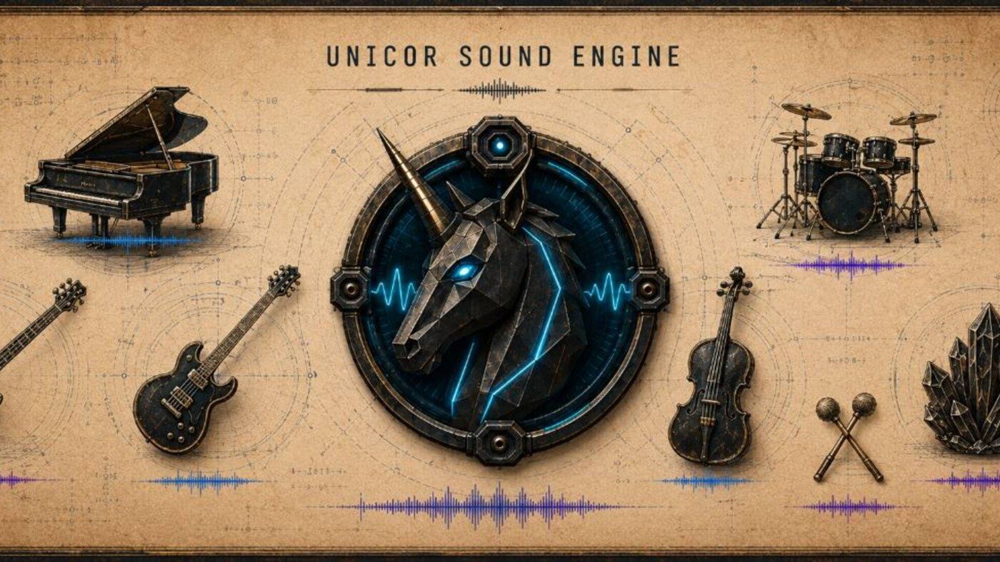

# DAW Core / Unicor SoundEngine

  

  <strong>Music software showcase for DAW Core, Unicor SoundEngine, Synthé, FX, VST distribution, and the Android beta track.</strong>

  <a href="#english">English</a> ·
  <a href="#francais">Francais</a> ·
  <a href="docs/one-pager.md">One-pager</a> ·
  <a href="docs/project-map.md">Project map</a> ·
  <a href="docs/proof-pack.md">Proof pack</a> ·
  <a href="docs/buyer-brief.md">Buyer brief</a>

## English

### What This Repository Is

This repository is the public presentation layer for the music side of my work. **DAW Core** is the priority product: a local-first workstation direction built around composing, saving, reopening, moving projects between supported surfaces, and keeping the audio workflow testable enough for serious demos and partner reviews.

**Unicor SoundEngine** is the ecosystem around that core. It groups the **Synthé** instrument work, **FX** families, VST distribution, audition material, product documentation, and release-readiness notes. The goal is to present one coherent music product line, not a pile of unrelated repos.

### Public Entry Points

Start with the [one-pager](docs/one-pager.md) if you need the product story in a few minutes. Use the [project map](docs/project-map.md) to understand how DAW Core, Synthé, FX, VST distribution, audition, and Android beta work connect. The [user flows](docs/user-flows.md) and [tutorials](docs/tutorials.md) explain how a musician, tester, or partner can read the product through real usage rather than abstract architecture.

For evaluation, the useful path is [evidence](docs/evidence.md), [proof pack](docs/proof-pack.md), [QA validation](docs/qa-validation.md), [release readiness](docs/release-readiness.md), and [current status](docs/current-status.md). For a commercial or collaboration discussion, read the [buyer brief](docs/buyer-brief.md), [partnership brief](docs/partnership.md), and [decision pack](docs/decision-pack.md).

Visual material is in [assets](assets/README.md), [visual index](docs/visual-index.md), [brand charter](docs/brand-charter.md), and [iconography](docs/iconography.md). Synth and distribution context is grouped in [synth suite](docs/synth-suite.md), [VST distribution](docs/vst-distribution.md), and [resources](docs/resources.md).

### Product Tracks

  
  <strong>DAW Core is the anchor.</strong> 
  DAW Core carries the product promise: a music project should survive save, reload, transport, and review. The Android beta track matters because it turns that promise into a concrete testing conversation: device class, audio route, project load/save behavior, expected proof, and what kind of feedback helps.

 

  
  <strong>Synthé and FX are grouped as musical capabilities.</strong> 
  The synth suite, effects families, presets, audition surfaces, and plugin documentation sit around DAW Core. They give the workstation sound, character, testing material, and product depth without competing with the main project.

 

  
  <strong>Distribution and proof are part of the product.</strong> 
  VST catalog pages, manuals, visual assets, release notes, QA summaries, and proof packs help a visitor understand the work before a private demo, mission discussion, partnership call, or investment conversation.

 

### Contact And Collaboration

Useful conversations can start from several angles: Android closed-beta testing, DAW workflow feedback, audio QA, plugin UX, sound design, VST packaging, distribution, product review, funding, mission work, or a role around creative tools and music software.

The strongest signal I can provide publicly is structure: product map, user flows, proof summaries, release-readiness notes, and a clear explanation of what each covered repo contributes. Deeper technical review can be scoped separately when the conversation needs it.

Public contact route: [GitHub charli-dev420](https://github.com/charli-dev420).

### Public Boundary

This showcase publishes product narrative, visuals, user-facing docs, QA summaries, proof structure, and decision material. Detailed source, release artifacts, private sessions, internal logs, credentials, and raw QA folders stay outside the public repo.

## Francais

### Ce Que Presente Ce Repo

Ce repo est la couche de presentation publique de mon axe musique. **DAW Core** est le produit prioritaire: une direction workstation local-first construite autour de la composition, sauvegarde, reouverture, circulation entre surfaces supportees et validation audio lisible pour demos, tests et discussions partenaires.

**Unicor SoundEngine** est l'ecosysteme autour du coeur. Il regroupe **Synthé**, les familles **FX**, la distribution VST, l'audition, la documentation produit et les notes de readiness. L'objectif est de montrer une ligne produit coherente, pas une addition de repos disperses.

### Points D'Entree Publics

Le [one-pager](docs/one-pager.md) donne l'histoire produit rapidement. La [carte projet](docs/project-map.md) montre comment DAW Core, Synthé, FX, distribution VST, audition et beta Android se relient. Les [flux utilisateur](docs/user-flows.md) et les [tutoriels](docs/tutorials.md) permettent de lire le produit par l'usage.

Pour evaluer la maturite, le bon chemin passe par [preuves](docs/evidence.md), [proof pack](docs/proof-pack.md), [QA validation](docs/qa-validation.md), [release readiness](docs/release-readiness.md) et [statut courant](docs/current-status.md). Pour une discussion commerciale, partenariat, mission ou poste, lire aussi [buyer brief](docs/buyer-brief.md), [partenariat](docs/partnership.md) et [decision pack](docs/decision-pack.md).

Les supports visuels sont dans [assets](assets/README.md), [index visuel](docs/visual-index.md), [charte](docs/brand-charter.md) et [iconographie](docs/iconography.md). Le contexte Synthé et distribution est regroupe dans [suite synthés](docs/synth-suite.md), [distribution VST](docs/vst-distribution.md) et [ressources](docs/resources.md).

### Axes Produit

  
  <strong>DAW Core est l'ancre.</strong> 
  DAW Core porte la promesse produit: un projet musical doit survivre a la sauvegarde, reouverture, circulation et revue. La piste beta Android rend cette promesse concrete: classe d'appareil, route audio, scenario load/save, preuve attendue et retours utiles.

 

  
  <strong>Synthé et FX sont des capacites musicales regroupees.</strong> 
  La suite synthés, les effets, presets, surfaces d'audition et docs plugins entourent DAW Core. Ils apportent son, caractere, matiere de test et profondeur produit sans concurrencer le projet principal.

 

  
  <strong>La distribution et les preuves font partie du produit.</strong> 
  Catalogue VST, manuels, visuels, notes release, syntheses QA et proof packs aident un visiteur a comprendre le travail avant une demo privee, une mission, un partenariat ou une discussion financement.

 

### Contact Et Collaboration

Les discussions utiles peuvent partir de plusieurs angles: test beta Android, retour workflow DAW, QA audio, UX plugin, sound design, packaging VST, distribution, revue produit, financement, mission ou poste autour des outils creatifs et du logiciel musical.

Le signal public principal est la structure: carte produit, flux utilisateur, syntheses de preuves, readiness release et explication claire du role de chaque repo couvert. Une revue technique plus profonde peut etre cadree separement quand la discussion le demande.

Contact public recommande: [GitHub charli-dev420](https://github.com/charli-dev420).

### Frontiere Publique

Cette vitrine publie narration produit, visuels, docs utilisateur, syntheses QA, structure de preuve et materiel de decision. Les sources detaillees, artefacts release, sessions privees, logs internes, credentials et dossiers QA bruts restent hors du repo public.
