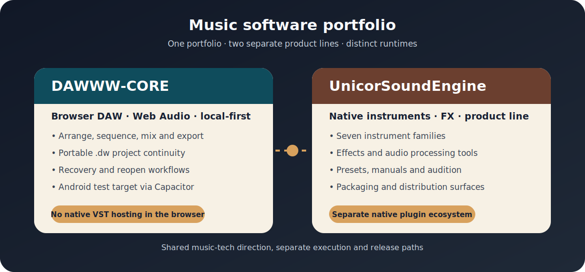
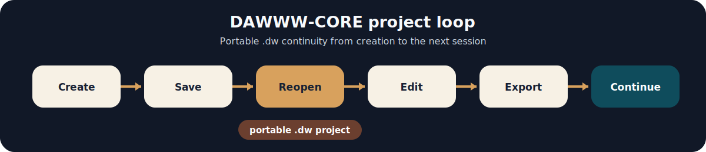

# DAWWW-CORE local and cross device MAO studio

<p align="center">
  
</p>

<p align="center">
  <strong>Browser music production · Web Audio · Portable .dw projects · Native instruments and effects</strong>
</p>

<p align="center">
  <a href="#english">🇬🇧 English</a> · <a href="#francais">🇫🇷 Français</a>
</p>

---

<h2 id="english">🇬🇧 English</h2>

I build music software through two distinct product lines:

- **DAWWW-CORE**, a browser-based music studio;
- **UnicorSoundEngine**, a separate collection of native instruments and effects.

They belong to the same music-tech portfolio, but they are different products. DAWWW-CORE does not load native VST plugins inside the browser.

<p align="center">
  
</p>

## DAWWW-CORE

DAWWW-CORE is a local-first browser DAW designed for creating, editing and continuing music projects without making the whole session depend on a temporary browser state.

The studio brings together:

- arranger and timeline;
- sequencer and piano roll;
- mixer;
- built-in instruments;
- sampler;
- audio effects;
- automation and modulation;
- project recovery;
- audio and stem export.

### Portable `.dw` projects

The `.dw` format is the project container used by DAWWW-CORE. Its purpose is to keep the musical session portable:

```text
create → save → reopen → edit → export → continue
```

<p align="center">
  
</p>

A `.dw` project can preserve the session structure, musical data, settings and referenced material needed to continue working later.

### Platforms

The main DAWWW-CORE experience targets desktop browsers. An Android version is also maintained through Capacitor as an active mobile target.

[Learn more about DAWWW-CORE](docs/dawww-core.md)

## UnicorSoundEngine

UnicorSoundEngine is a separate native audio-plugin line built around seven instrument families:

| Family | Direction |
| --- | --- |
| **Piano** | Keyboard and piano-oriented instruments |
| **Percussion** | Percussive and acoustic-hit instruments |
| **Bass** | Bass instruments and low-frequency sound design |
| **Guitar** | Guitar-oriented instruments and textures |
| **Drum** | Drum synthesis and rhythm-focused instruments |
| **Orchestral** | Orchestral and cinematic sound families |
| **Rare** | Less common instruments and experimental sources |

The line also includes native audio effects, presets, manuals, product pages and listening material.

[Discover UnicorSoundEngine](docs/unicorsoundengine.md) · [Explore the FX line](docs/fx-line.md) · [Audition and listening](docs/audition-review.md)

## Two different audio paths

| DAWWW-CORE | UnicorSoundEngine |
| --- | --- |
| Browser DAW | Native plugin ecosystem |
| Web Audio runtime | VST and native audio products |
| Portable `.dw` projects | Instruments, effects and presets |
| Built-in browser instruments and effects | Standalone plugin releases |
| Desktop web and Android target | Native DAW compatibility |

## Explore

- [Music portfolio overview](docs/project-overview.md)
- [DAWWW-CORE](docs/dawww-core.md)
- [UnicorSoundEngine](docs/unicorsoundengine.md)
- [FX line](docs/fx-line.md)
- [Audition and listening](docs/audition-review.md)
- [Frequently asked questions](docs/faq.md)

## Contact

- DAWWW-CORE: [contact@dawww-core-local.com](mailto:contact@dawww-core-local.com)
- UnicorSoundEngine and general contact: [unicornwhodev@gmail.com](mailto:unicornwhodev@gmail.com)

---

<h2 id="francais">🇫🇷 Français</h2>

Je développe des outils musicaux autour de deux lignes produit distinctes :

- **DAWWW-CORE**, un studio musical dans le navigateur ;
- **UnicorSoundEngine**, une collection séparée d’instruments et d’effets natifs.

Les deux appartiennent au même portfolio music-tech, mais ce sont des produits différents. DAWWW-CORE ne charge pas de plugins VST natifs dans le navigateur.

<p align="center">
  
</p>

## DAWWW-CORE

DAWWW-CORE est un DAW navigateur local-first conçu pour créer, modifier et poursuivre des projets musicaux sans faire dépendre toute la session d’un état temporaire du navigateur.

Le studio réunit :

- arrangeur et timeline ;
- séquenceur et piano roll ;
- mixer ;
- instruments intégrés ;
- sampler ;
- effets audio ;
- automation et modulation ;
- récupération de projet ;
- export audio et stems.

### Projets portables `.dw`

Le format `.dw` est le conteneur projet utilisé par DAWWW-CORE. Son rôle est de garder la session musicale portable :

```text
créer → sauvegarder → rouvrir → modifier → exporter → continuer
```

<p align="center">
  
</p>

Un projet `.dw` peut préserver la structure de session, les données musicales, les réglages et la matière référencée nécessaire pour continuer le travail plus tard.

### Plateformes

L’expérience principale de DAWWW-CORE cible les navigateurs desktop. Une version Android est également maintenue via Capacitor comme cible mobile active.

[Découvrir DAWWW-CORE](docs/dawww-core.md)

## UnicorSoundEngine

UnicorSoundEngine est une ligne séparée de plugins audio natifs construite autour de sept familles d’instruments :

| Famille | Direction |
| --- | --- |
| **Piano** | Instruments orientés clavier et piano |
| **Percussion** | Percussions et sons d’impact acoustiques |
| **Bass** | Basses et travail des fréquences graves |
| **Guitar** | Instruments et textures orientés guitare |
| **Drum** | Synthèse de batterie et instruments rythmiques |
| **Orchestral** | Familles orchestrales et cinématiques |
| **Rare** | Instruments moins courants et sources expérimentales |

La ligne comprend également des effets audio natifs, des presets, des manuels, des pages produit et de la matière d’écoute.

[Découvrir UnicorSoundEngine](docs/unicorsoundengine.md) · [Explorer la ligne FX](docs/fx-line.md) · [Audition et écoute](docs/audition-review.md)

## Deux chemins audio différents

| DAWWW-CORE | UnicorSoundEngine |
| --- | --- |
| DAW navigateur | Écosystème de plugins natifs |
| Runtime Web Audio | Produits audio VST et natifs |
| Projets portables `.dw` | Instruments, effets et presets |
| Instruments et effets intégrés au navigateur | Plugins autonomes |
| Web desktop et cible Android | Compatibilité avec les DAW natifs |

## Explorer

- [Vue du portfolio musique](docs/project-overview.md)
- [DAWWW-CORE](docs/dawww-core.md)
- [UnicorSoundEngine](docs/unicorsoundengine.md)
- [Ligne FX](docs/fx-line.md)
- [Audition et écoute](docs/audition-review.md)
- [Questions fréquentes](docs/faq.md)

## Contact

- DAWWW-CORE : [contact@dawww-core-local.com](mailto:contact@dawww-core-local.com)
- UnicorSoundEngine et contact général : [unicornwhodev@gmail.com](mailto:unicornwhodev@gmail.com)
