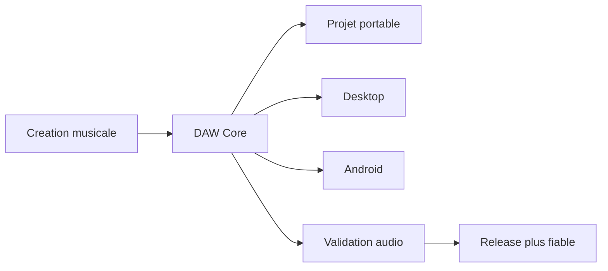
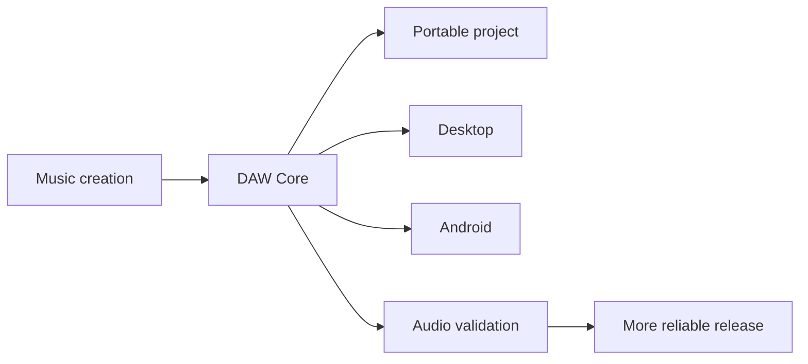

# Music Project Presentation / Presentation projet musique

> Public-safe presentation repository. This repository is a showcase and partnership brief, not a source-code release.

[FR](#francais) | [EN](#english)

## Francais

### Positionnement

Ce depot presente l'ecosysteme musique porte par **DAW Core** et **Unicor SoundEngine**.

Le projet principal est **DAW Core**: une station audio locale-first pensee pour composer, structurer et tester des projets musicaux sur desktop et Android, avec un format de projet portable.

Les projets secondaires sont regroupes sous **Unicor SoundEngine**: une suite de synthés, effets, site VST et surfaces de distribution. Les synthés et les effets sont presentes ensemble pour garder une lecture claire.

### Ce que ce depot contient

- Une presentation publique et bilingue du projet.
- Une lecture produit: vision, surfaces, publics cibles, axes de partenariat.
- Des informations volontairement non sensibles sur DAW Core, la suite VST, les synthés et les effets.
- Des documents courts pour partenaires, financement, emploi ou collaboration.

### Ce que ce depot ne contient pas

- Aucun code source produit.
- Aucun binaire VST, APK, build desktop ou fichier de plugin.
- Aucun secret, cle, configuration serveur, preuve QA interne ou chemin local.
- Aucun dataset, preset prive, session utilisateur ou artefact de release.

### Projet majeur: DAW Core

DAW Core est la piece centrale: un environnement audio local-first oriente creation, experimentation, sauvegarde portable et workflows QA reels.

Axes publics:

- station audio locale-first;
- surface desktop/web;
- surface Android;
- format de projet portable;
- validation audio et workflow utilisateur;
- priorite a la robustesse produit plutot qu'a une demo superficielle.

### Projet secondaire: Unicor SoundEngine

Unicor SoundEngine regroupe la partie plugins et distribution:

- synthés;
- effets;
- site VST;
- presentation produit;
- documentation et surfaces publiques;
- distribution controlee des livrables.

La presentation publique reste volontairement groupee: l'objectif est de montrer une suite musicale coherente, pas de disperser la lecture entre de nombreux petits depots.

### Recherche

Le projet recherche:

- partenaires musique et audio software;
- financement pour stabilisation produit, design sonore, tests, packaging et distribution;
- collaboration technique sur audio temps reel, UX musicale, QA audio et Android;
- missions ou emploi autour de produits audio, outils creatifs, IA appliquee et apps local-first.

### Contact

Contact public recommande: [GitHub charli-dev420](https://github.com/charli-dev420).

## English

### Positioning

This repository presents the music ecosystem behind **DAW Core** and **Unicor SoundEngine**.

The main project is **DAW Core**: a local-first audio workstation designed for composing, structuring, and testing music projects on desktop and Android, with a portable project format.

Secondary projects are grouped under **Unicor SoundEngine**: synthesizers, effects, the VST site, and distribution surfaces. Synths and effects are grouped together to keep the presentation focused.

### What this repository contains

- A public-safe bilingual project presentation.
- A product-level view: vision, surfaces, target users, and partnership angles.
- Non-sensitive information about DAW Core, the VST suite, synths, and effects.
- Short documents for partners, funding, employment, or collaboration.

### What this repository does not contain

- No product source code.
- No VST binaries, APKs, desktop builds, or plugin files.
- No secrets, keys, server configuration, internal QA evidence, or local paths.
- No datasets, private presets, user sessions, or release artifacts.

### Major project: DAW Core

DAW Core is the central product: a local-first audio environment focused on creation, experimentation, portable saves, and real workflow validation.

Public-safe themes:

- local-first audio workstation;
- desktop/web surface;
- Android surface;
- portable project format;
- audio and user-workflow validation;
- product robustness before superficial demos.

### Secondary project: Unicor SoundEngine

Unicor SoundEngine groups the plugin and distribution work:

- synthesizers;
- effects;
- VST site;
- product presentation;
- documentation and public surfaces;
- controlled distribution of deliverables.

The public presentation is deliberately grouped: the goal is to show a coherent music suite, not to overload the page with many small repositories.

### Looking for

The project is open to:

- music and audio software partners;
- funding for product stabilization, sound design, testing, packaging, and distribution;
- technical collaboration around realtime audio, music UX, audio QA, and Android;
- work opportunities around audio products, creative tools, applied AI, and local-first apps.

### Contact

Recommended public contact: [GitHub charli-dev420](https://github.com/charli-dev420).
