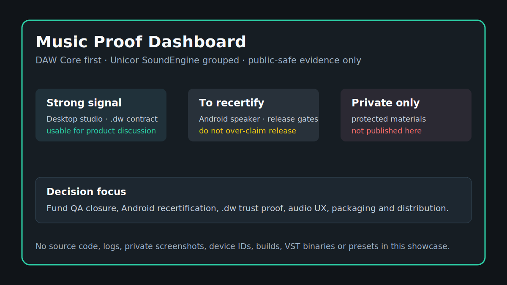

# Current Status / Statut courant

[FR](#francais) | [EN](#english)

## Francais

Cette page resume l'etat publiable de la vitrine music. Elle ne remplace pas les artefacts internes; elle explique ce qu'un lecteur peut croire, demander ou verifier.

| Surface | Statut public | Preuve exploitable | Lecture prudente |
| --- | --- | --- | --- |
| DAW Core desktop studio | Certifiable par gate complet | Synthese issue du statut courant et de la matrice QA. | Bon signal produit, mais le verdict release formel reste lie au gate release. |
| DAW Core Android APK | A recertifier | Nouveau gate Android studio-grade attendu. | Anciennes preuves utiles comme contexte, non comme signature release. |
| `.dw` portable | Contrat produit documente | Checksum, assets embarques, snapshots, roundtrip desktop/Android. | Le cross-device complet doit rester une preuve a rejouer avant release. |
| Unicor SoundEngine synthés | Documentation utilisateur existante | Architecture commune UWdeVST: macros, FX, presets, sorties. | Les binaires, installateurs et CSV QA restent prives. |
| Suite FX | Carte produit groupee | Families d'effets identifiees. | Pas de claim DSP sans preuve publique specifique. |
| VST-site / distribution | Surface produit privee | Role catalogue/distribution explique. | Pas de details storage, paiement, admin ou release. |

### Personnalisation de cette vitrine

Le message doit rester net: **DAW Core est le projet majeur**. Synthés, FX, VST-site et audition renforcent l'ecosysteme, mais ne doivent pas masquer le coeur audio local-first.

## English

This page summarizes the public state of the music showcase. DAW Core desktop has the strongest proof signal; Android must be recertified through the active gate; `.dw` portability is documented but cross-device proof should be replayed before release; synths, FX, VST-site, and audition are grouped as supporting surfaces.
