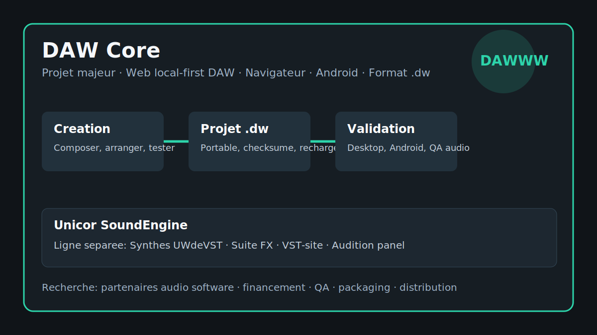

# DAW Core / Unicor SoundEngine One-Pager

[EN](#english) | [FR](#francais)

## English

### Product In One Sentence

**DAW Core** is the main music software project: a browser-based **web local-first DAW** where a saved musical session should reopen with its intent intact. **Unicor SoundEngine** is a separate line for Synthé, FX, VST distribution, audition material, and proof documentation.

### Why It Matters

The project is valuable because it treats music software as a workflow, not only as audio output. A useful DAW has to survive the ordinary moments that decide trust: save a project, close the app, reopen it, load the same musical state, play it back, and make the next edit without wondering what changed.

This repository makes the music portfolio readable from the outside. It explains what belongs to DAW Core, what belongs to Synthé / FX / VST, how the Android beta can be tested on real devices, and where a tester, partner, buyer, funder, recruiter, or mission lead can look when they need to understand what already exists.

### What To Evaluate

DAW Core is the anchor and should be evaluated as a web local-first DAW. The `.dw` project direction, browser/desktop validation vocabulary, Android beta path, and release-readiness notes show how the product is meant to grow around project continuity: create, save, reload, inspect, and repeat with evidence.

Unicor SoundEngine should be evaluated separately. Synthé covers the instrument suite a musician can audition; FX groups treatment families; VST distribution gives that line a catalog, manuals, assets, and packages a buyer or distributor can judge.

The proof material is structured for review. Use the [project map](project-map.md), [user flows](user-flows.md), [proof pack](proof-pack.md), [QA validation](qa-validation.md), [release readiness](release-readiness.md), and [buyer brief](buyer-brief.md) to evaluate the project from real scenes: a tester loading a project, a partner judging stability, or a buyer checking the current product surface.

### Good Next Conversations

Good next conversations are practical: run the Android beta on selected devices, review whether a DAW Core browser project resumes cleanly, test web audio behavior, shape Synthé presets, prioritize FX, harden VST packaging, or discuss funding, partnership, mission work, and roles around creative tools or music software.

## Francais

### Produit En Une Phrase

**DAW Core** est le projet musical principal: un **web local-first DAW** dans le navigateur ou une session musicale sauvegardee doit se rouvrir avec son intention intacte. **Unicor SoundEngine** est une ligne separee pour Synthé, FX, distribution VST, audition et documentation de preuve.

### Pourquoi C'Est Important

La valeur du projet vient du workflow, pas seulement du rendu audio. Un DAW utile doit tenir dans les moments ordinaires qui creent la confiance: sauvegarder un projet, fermer l'app, le rouvrir, retrouver le meme etat musical, relancer la lecture et continuer l'edition sans se demander ce qui a change.

Ce repo rend le portfolio musical lisible depuis l'exterieur. Il explique ce qui appartient a DAW Core, ce qui appartient a Synthé / FX / VST, comment la beta Android peut etre testee sur de vrais appareils, et ou un testeur, partenaire, acheteur, financeur, recruteur ou responsable mission peut regarder pour comprendre ce qui existe deja.

### Ce Qu'Il Faut Evaluer

DAW Core est l'ancre et doit etre evalue comme web local-first DAW. La direction `.dw`, le vocabulaire de validation navigateur/desktop, la piste beta Android et les notes de release readiness montrent comment le produit doit progresser autour de la continuite projet: creer, sauvegarder, recharger, inspecter et repeter avec preuve.

Unicor SoundEngine doit etre evalue separement. Synthé couvre la suite instrumentale qu'un musicien peut auditionner; FX regroupe des familles de traitements; la distribution VST donne a cette ligne un catalogue, des manuels, des assets et des packages qu'un acheteur ou distributeur peut juger.

Les preuves sont structurees pour la revue. Utiliser [project map](project-map.md), [user flows](user-flows.md), [proof pack](proof-pack.md), [QA validation](qa-validation.md), [release readiness](release-readiness.md) et [buyer brief](buyer-brief.md) pour evaluer a partir de scenes reelles: un testeur qui charge un projet, un partenaire qui juge la stabilite, ou un acheteur qui verifie la surface produit actuelle.

### Bons Sujets De Discussion

Les bonnes prochaines discussions sont pratiques: lancer la beta Android sur des appareils choisis, verifier si un projet DAW Core navigateur reprend proprement, tester le comportement web audio, travailler les presets Synthé, prioriser les FX, durcir le packaging VST, ou parler financement, partenariat, mission et poste autour des outils creatifs ou du logiciel musical.
