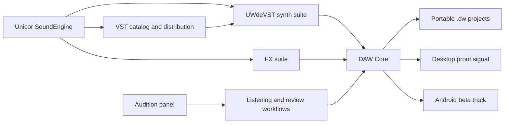
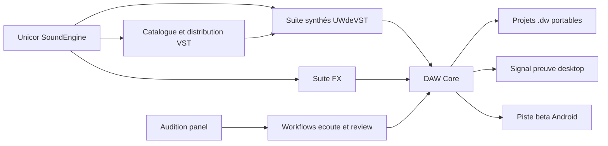

# Project Map / Carte projet

[EN](#english) | [FR](#francais)

## English

### Reading Model

This showcase represents a private multi-repository ecosystem. The public map keeps the product understandable without exposing source code, builds, storage details, QA folders, or private user material.

DAW Core is the center. Unicor SoundEngine is the supporting music layer around it: synths, FX, VST catalog/distribution, manuals, audition, and review material.

| Layer | Real repository or family | Product role | Public here | Private boundary |
| --- | --- | --- | --- | --- |
| Main product | `charli-dev420/daw-core` | Local-first workstation, desktop/web surface, Android beta track, `.dw` project continuity. | Product story, workflows, portable-project contract, evidence summaries, readiness notes. | Source, full gates, builds, device logs, local configs, release folders. |
| Distribution | `charli-dev420/VST-site` | Catalog and distribution layer for Unicor SoundEngine. | Public asset inventory, synth presentation gallery, manual references, distribution positioning. | Backend, storage, admin, payment, release binaries, private accounts. |
| Synth suite | `UWdeVST / synthe-*` | Seven instrument families sharing UX and release discipline. | Suite-level narrative, technical QA signals, musical role by instrument, public docs framing. | JUCE/C++ code, installers, presets, CSV QA, internal audio checks. |
| FX suite | `charli-dev420/fx-*` | Effects grouped by treatment family: analysis, delay, distortion, dynamics, EQ, modulation, pitch/time, reverb, stereo. | Grouped product role and integration narrative. | DSP implementation, private presets, raw tests, release artifacts. |
| Audition | `charli-dev420/audition-panel` | Preparation and review surface for listening, comparison, and demo discipline. | Product role, review expectations, fit inside the proof workflow. | Private sessions, output audio, captures, local paths. |

### Ecosystem Diagram

### How To Read The Repos

Read the repo family as one product system:

- **DAW Core** is the workstation and the main reason to care.
- **Synths and FX** are musical capabilities that strengthen DAW Core.
- **VST-site** explains how the plugin ecosystem can be presented and distributed.
- **Audition tooling** helps turn audio behavior into reviewable evidence.
- **Docs and proof packs** make the private work legible to outside readers.

The goal is not to inflate the number of projects. The goal is to show that the central product has a surrounding ecosystem ready for serious testing, packaging, and partnership work.

## Francais

### Modèle de lecture

Cette vitrine représente un écosystème privé multi-repos. La carte publique rend le produit compréhensible sans exposer code source, builds, stockage, dossiers QA ou matériel utilisateur privé.

DAW Core est le centre. Unicor SoundEngine est la couche musicale autour: synthés, FX, catalogue/distribution VST, manuels, audition et matériel de review.

| Couche | Repo ou famille réelle | Rôle produit | Public ici | Limite privée |
| --- | --- | --- | --- | --- |
| Produit principal | `charli-dev420/daw-core` | Workstation local-first, surface desktop/web, piste beta Android, continuité `.dw`. | Histoire produit, workflows, contrat projet portable, synthèses preuves, readiness. | Source, gates complets, builds, logs device, configs locales, dossiers release. |
| Distribution | `charli-dev420/VST-site` | Catalogue et distribution Unicor SoundEngine. | Inventaire assets publics, galerie synthés, références manuels, positionnement distribution. | Backend, storage, admin, paiement, binaires release, comptes privés. |
| Suite synthés | `UWdeVST / synthe-*` | Sept familles d'instruments partageant UX et discipline release. | Narration de suite, signaux QA techniques, rôle musical par instrument, docs publiques. | Code JUCE/C++, installateurs, presets, CSV QA, écoutes internes. |
| Suite FX | `charli-dev420/fx-*` | Effets regroupés par famille: analyse, delay, distortion, dynamics, EQ, modulation, pitch/time, reverb, stereo. | Rôle produit groupé et narration d'intégration. | DSP, presets privés, tests bruts, artefacts release. |
| Audition | `charli-dev420/audition-panel` | Préparation et review pour écoute, comparaison et discipline démo. | Rôle produit, critères de review, place dans le workflow preuve. | Sessions privées, audio de sortie, captures, chemins locaux. |

### Diagramme écosystème

### Comment lire les repos

Lire la famille comme un seul système produit:

- **DAW Core** est la workstation et la raison principale de s'intéresser au projet.
- **Synthés et FX** sont des capacités musicales qui renforcent DAW Core.
- **VST-site** montre comment l'écosystème plugin peut être présenté et distribué.
- **Audition** aide à transformer le comportement audio en preuve reviewable.
- **Docs et proof packs** rendent le travail privé lisible pour un lecteur extérieur.

Le but n'est pas de gonfler artificiellement le nombre de projets. Le but est de montrer qu'un produit central possède déjà un écosystème prêt pour test sérieux, packaging et partenariats.
