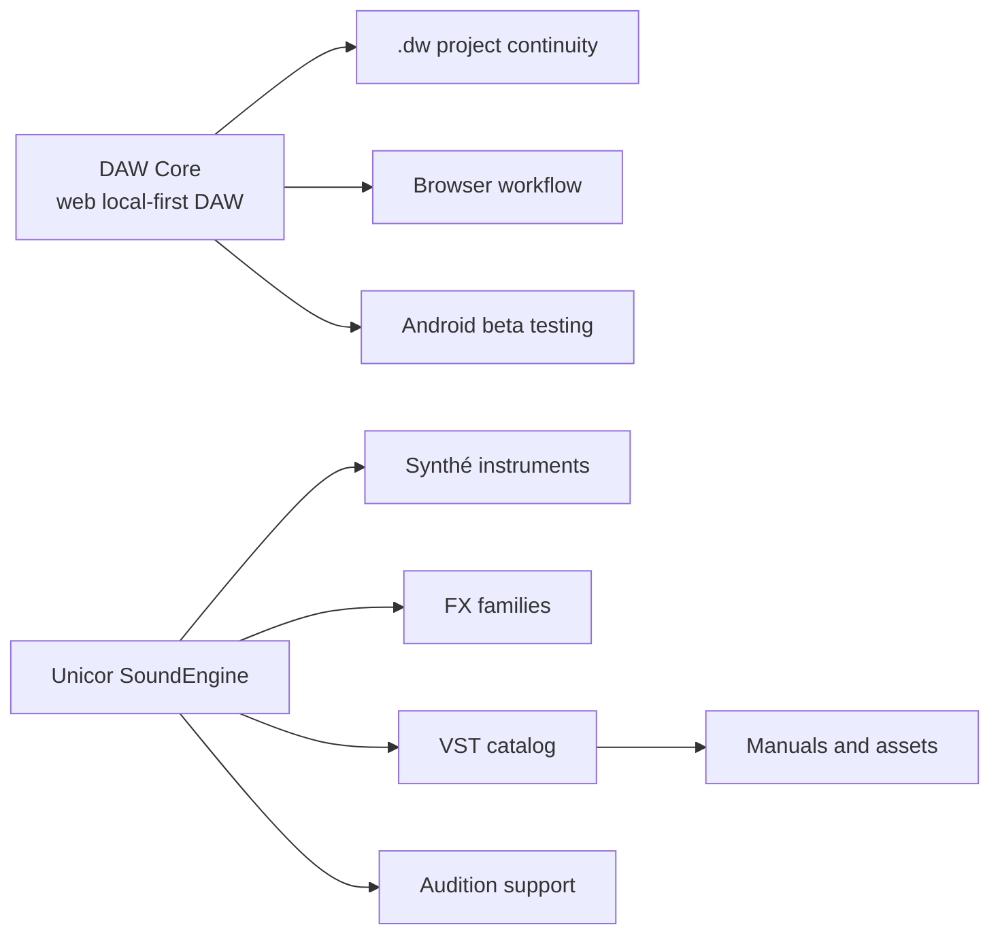
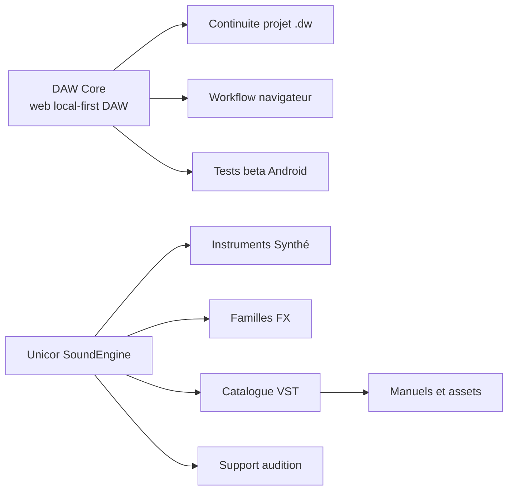

# Project Map / Carte projet

[EN](#english) | [FR](#francais)

## English

### Reading Model

The music work is easier to understand when it is read as two separate lines.

**DAW Core** is the major product: a browser-based **web local-first DAW** with `.dw` project continuity and Android beta testing.

**Unicor SoundEngine** is the sound/software line: Synthé instruments, FX families, VST distribution, audition support, manuals, and visuals.

### Real Project Families

**DAW Core** represents the browser DAW work: project creation, save/reload behavior, `.dw` continuity, Android beta review, QA language, and release preparation.

**VST-site** represents the catalog and distribution layer for Unicor SoundEngine: product pages, manual references, public visuals, and distribution readiness.

**UWdeVST synth projects** represent the Synthé family: Piano, Guitar, Bass, Perc, Drum, Orch, and Rare / Instr. They are grouped as one instrument suite because the reader needs roles, controls, presets, manuals, and listening priorities, not a scattered list.

**FX projects** represent treatment families: analysis, delay, distortion, dynamics, EQ, modulation, pitch/time, reverb, and stereo. They should be prioritized by musical usefulness and product clarity.

**Audition tooling** represents listening, comparison, and review support for Unicor SoundEngine.

### Ecosystem Diagram

### How To Use This Map

Use this page to avoid mixing the projects. DAW Core is the browser DAW and the first priority. Unicor SoundEngine is a separate sound/software line. The two can share a portfolio, brand discipline, and audio-product thinking without becoming one functional system.

For the product explanation, read [overview](overview.md), [DAW Core](daw-core.md), and [Unicor SoundEngine](unicor-soundengine.md). For current state and validation, read [current status](current-status.md), [evidence](evidence.md), and [QA validation](qa-validation.md).

## Francais

### Modele De Lecture

Le travail musique est plus simple a comprendre quand il est lu comme deux lignes separees.

**DAW Core** est le produit majeur: un **web local-first DAW** dans le navigateur, avec continuite projet `.dw` et tests beta Android.

**Unicor SoundEngine** est la ligne son/software: instruments Synthé, familles FX, distribution VST, audition, manuels et visuels.

### Familles De Projets Reelles

**DAW Core** represente le travail DAW navigateur: creation projet, sauvegarde/reouverture, continuite `.dw`, beta Android, langage QA et preparation release.

**VST-site** represente la couche catalogue et distribution pour Unicor SoundEngine: pages produit, references manuels, visuels publics et readiness distribution.

**Les projets synthés UWdeVST** representent la famille Synthé: Piano, Guitar, Bass, Perc, Drum, Orch et Rare / Instr. Ils sont groupes comme une suite instrumentale parce qu'un lecteur a besoin de roles, controles, presets, manuels et priorites d'ecoute, pas d'une liste dispersee.

**Les projets FX** representent les familles de traitement: analysis, delay, distortion, dynamics, EQ, modulation, pitch/time, reverb et stereo. Ils doivent etre priorises par utilite musicale et clarte produit.

**L'audition** represente le support d'ecoute, de comparaison et de revue pour Unicor SoundEngine.

### Diagramme Ecosysteme

### Comment Utiliser Cette Carte

Utiliser cette page pour ne pas melanger les projets. DAW Core est le DAW navigateur et la priorite. Unicor SoundEngine est une ligne son/software separee. Les deux peuvent partager un portfolio, une discipline de marque et une pensee produit audio sans devenir un seul systeme fonctionnel.

Pour l'explication produit, lire [overview](overview.md), [DAW Core](daw-core.md) et [Unicor SoundEngine](unicor-soundengine.md). Pour l'etat courant et la validation, lire [current status](current-status.md), [evidence](evidence.md) et [QA validation](qa-validation.md).
