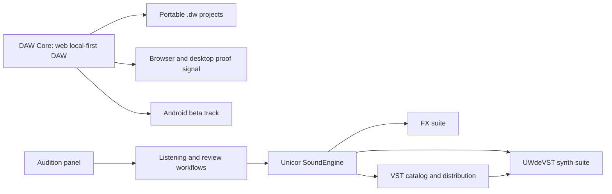
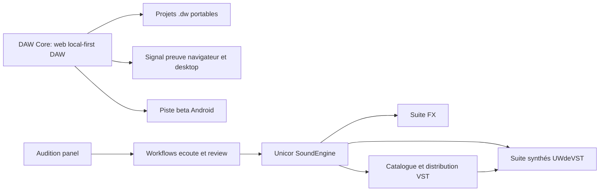

# Project Map / Carte projet

[EN](#english) | [FR](#francais)

## English

### Reading Model

This showcase represents a private multi-repository ecosystem. The public map keeps the product understandable without exposing source code, builds, storage details, QA folders, or private user material.

The map has two separate product lines. **DAW Core** is the major project: a browser-based web local-first DAW with `.dw` project continuity and an Android beta track. **Unicor SoundEngine** is the separate Synthé / FX / VST line with catalog, manuals, audition, and review material.

| Layer | Real repository or family | Product role | Public here | Private boundary |
| --- | --- | --- | --- | --- |
| Main product | `Unicorn Who Dev / daw-core` | Browser-based web local-first DAW, Android beta track, `.dw` project continuity. | Product story, workflows, portable-project contract, evidence summaries, readiness notes. | Source, full gates, builds, device logs, local configs, release folders. |
| Distribution | `Unicorn Who Dev / VST-site` | Catalog and distribution layer for Unicor SoundEngine, separate from DAW Core. | Public asset inventory, synth presentation gallery, manual references, distribution positioning. | Backend, storage, admin, payment, release binaries, private accounts. |
| Synth suite | `UWdeVST / synthe-*` | Seven instrument families sharing UX and release discipline. | Suite-level narrative, technical QA signals, musical role by instrument, public docs framing. | JUCE/C++ code, installers, presets, CSV QA, internal audio checks. |
| FX suite | `Unicorn Who Dev / fx-*` | Effects grouped by treatment family: analysis, delay, distortion, dynamics, EQ, modulation, pitch/time, reverb, stereo. | Grouped product role and review narrative. | DSP implementation, private presets, raw tests, release artifacts. |
| Audition | `Unicorn Who Dev / audition-panel` | Preparation and review surface for listening, comparison, and demo discipline. | Product role, review expectations, fit inside the Unicor review workflow. | Private sessions, output audio, captures, local paths. |

### Ecosystem Diagram

### How To Read The Repos

Read the repo family as a music portfolio with two separate product lines:

- **DAW Core** is the browser-based web local-first DAW and the main reason to care.
- **Synths and FX** are Unicor SoundEngine products, not DAW Core features.
- **VST-site** explains how the plugin ecosystem can be presented and distributed.
- **Audition tooling** helps turn Synthé / FX behavior into reviewable evidence.
- **Docs and proof packs** make the private work legible to outside readers.

The goal is not to inflate the number of projects. The goal is to show one strong DAW product and one separate plugin/sound product line, each with its own evaluation path.

## Francais

### Modèle de lecture

Cette vitrine représente un écosystème privé multi-repos. La carte publique rend le produit compréhensible sans exposer code source, builds, stockage, dossiers QA ou matériel utilisateur privé.

La carte a deux lignes produit séparées. **DAW Core** est le projet majeur: un web local-first DAW dans le navigateur, avec continuité `.dw` et piste beta Android. **Unicor SoundEngine** est la ligne Synthé / FX / VST séparée, avec catalogue, manuels, audition et matériel de review.

| Couche | Repo ou famille réelle | Rôle produit | Public ici | Limite privée |
| --- | --- | --- | --- | --- |
| Produit principal | `Unicorn Who Dev / daw-core` | Web local-first DAW dans le navigateur, piste beta Android, continuité `.dw`. | Histoire produit, workflows, contrat projet portable, synthèses preuves, readiness. | Source, gates complets, builds, logs device, configs locales, dossiers release. |
| Distribution | `Unicorn Who Dev / VST-site` | Catalogue et distribution Unicor SoundEngine, séparé de DAW Core. | Inventaire assets publics, galerie synthés, références manuels, positionnement distribution. | Backend, storage, admin, paiement, binaires release, comptes privés. |
| Suite synthés | `UWdeVST / synthe-*` | Sept familles d'instruments partageant UX et discipline release. | Narration de suite, signaux QA techniques, rôle musical par instrument, docs publiques. | Code JUCE/C++, installateurs, presets, CSV QA, écoutes internes. |
| Suite FX | `Unicorn Who Dev / fx-*` | Effets regroupés par famille: analyse, delay, distortion, dynamics, EQ, modulation, pitch/time, reverb, stereo. | Rôle produit groupé et narration de revue. | DSP, presets privés, tests bruts, artefacts release. |
| Audition | `Unicorn Who Dev / audition-panel` | Préparation et review pour écoute, comparaison et discipline démo. | Rôle produit, critères de review, place dans le workflow Unicor. | Sessions privées, audio de sortie, captures, chemins locaux. |

### Diagramme écosystème

### Comment lire les repos

Lire la famille comme un portfolio musical avec deux lignes produit séparées:

- **DAW Core** est le web local-first DAW dans le navigateur et la raison principale de s'intéresser au projet.
- **Synthés et FX** sont des produits Unicor SoundEngine, pas des fonctions DAW Core.
- **VST-site** montre comment l'écosystème plugin peut être présenté et distribué.
- **Audition** aide à transformer le comportement Synthé / FX en preuve reviewable.
- **Docs et proof packs** rendent le travail privé lisible pour un lecteur extérieur.

Le but n'est pas de gonfler artificiellement le nombre de projets. Le but est de montrer un produit DAW fort et une ligne plugin/son séparée, chacune avec son propre chemin d'évaluation.
