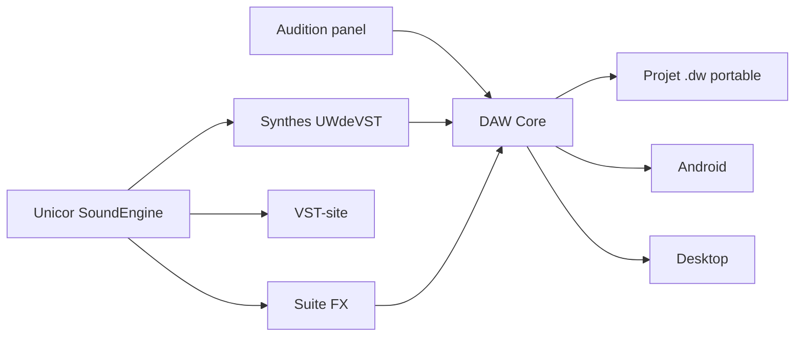

# Project Map / Carte projet

[FR](#francais) | [EN](#english)

## Francais

Cette vitrine represente plusieurs repos reels. Elle donne assez de contexte pour comprendre l'ecosysteme sans exposer le code ni les artefacts sensibles.

| Couche | Repo reel | Role | Publie ici | Non publie |
| --- | --- | --- | --- | --- |
| Projet majeur | `charli-dev420/daw-core` | Station audio locale-first, desktop/web, Android, format `.dw`. | Vision, flux, contrat public du projet portable, preuves synthetisees. | Code, gates complets, builds, logs, configs. |
| Distribution | `charli-dev420/VST-site` | Catalogue, docs et distribution Unicor SoundEngine. | Positionnement, ressources, familles de plugins. | Backend, stockage, comptes, configs. |
| Suite FX | `charli-dev420/fx-*` | Effets audio regroupes: analyse, delay, distortion, dynamics, EQ, modulation, pitch/time, reverb, stereo. | Lecture groupee et usages. | Implementations DSP, presets prives, tests bruts. |
| Suite synthés | `UWdeVST / synthe-*` | Instruments VST3 partages par architecture commune. | Synthese UX, familles, manuels adaptes. | Code JUCE/C++, binaires, CSV QA, installateurs. |
| Audition | `charli-dev420/audition-panel` | Surface de verification et preparation de rendus. | Role produit et criteres d'usage. | Captures internes, sessions, sorties audio. |

### Relation entre les projets

### Lecture produit

DAW Core reste le coeur. Les synthés, effets, site VST et surfaces d'audition servent a construire une suite musicale coherente autour de ce coeur. Cette vitrine ne cherche donc pas a faire une page separee par petit repo: elle montre le systeme complet et renvoie vers les documents utiles.

## English

This showcase represents several real repositories while keeping source code and sensitive artifacts private.

DAW Core is the major product. Unicor SoundEngine groups the synths, effects, VST site, and audition surfaces around that product. The public goal is to explain the complete music system, not to overload the reader with one page per internal repository.

The table above lists what is public here and what stays private.
