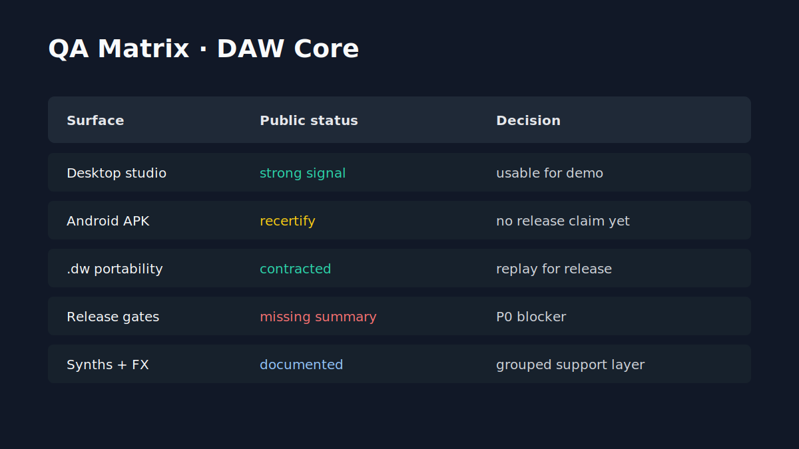

# QA Validation / Validation QA

[EN](#english) | [FR](#francais)

## English

### Public QA Matrix

| Surface | Validation path | Public-safe status | Why it matters |
| --- | --- | --- | --- |
| Desktop studio | Complete desktop gate. | `passed` / strong development proof. | Main proof base for DAW Core product discussion. |
| Android speaker route | Current Android studio-grade gate. | `to-recertify`. | Turns Android beta into device-specific evidence. |
| Android Bluetooth A2DP | Specific gate if the target scope includes A2DP. | `to-prove` for that offer. | Avoids vague audio-route promises. |
| `.dw` continuity | `test:dw:proof` plus runtime roundtrip. | `contracted`; release proof should be replayed for target scope. | Core trust path for DAW Core. |
| Desktop release | Scoped release summary. | `needs-current-public-go`. | Converts proof signal into release language. |
| Android release | Scoped Android release summary. | `needs-current-public-go`. | Converts beta evidence into a distribution decision. |
| UWdeVST synth suite | Automated technical QA plus RC listening review. | `technical-ok`, listening review by selected families. | Keeps synth suite claims credible and musical. |

### Status Vocabulary

| Status | Meaning |
| --- | --- |
| `passed` | Positive, dated evidence that can support a written summary. |
| `to-recertify` | Useful prior context exists, but the current decision needs a fresh run. |
| `to-prove` | Scope is understood, proof still needs to be produced for the claim. |
| `contracted` | Product contract is defined; release proof depends on replaying the target scenario. |
| `technical-ok` | Automated technical signal is positive; musical or release sign-off may still be scoped. |
| `operator-retained` | Operator proof can be retained only while the underlying surface has not changed. |

### Publication Rule

A public QA claim should be written, dateable, tied to a surface, and phrased at the right level. Raw logs, local paths, device identifiers, internal screenshots, output JSON, CSV files, APKs, VST binaries, and release folders stay out of this repository.

## Francais

### Matrice QA publique

| Surface | Chemin validation | Statut public-safe | Pourquoi c'est important |
| --- | --- | --- | --- |
| Desktop studio | Gate desktop complet. | `passed` / preuve développement forte. | Base principale pour discuter DAW Core comme produit. |
| Route speaker Android | Gate Android studio-grade courant. | `to-recertify`. | Transforme la beta Android en preuve device-specific. |
| Android Bluetooth A2DP | Gate spécifique si le scope cible A2DP. | `to-prove` pour cette offre. | Evite les promesses audio-route vagues. |
| Continuité `.dw` | `test:dw:proof` + roundtrip runtime. | `contracted`; preuve release à rejouer selon scope. | Chemin de confiance coeur pour DAW Core. |
| Release desktop | Summary release scoped. | `needs-current-public-go`. | Transforme le signal preuve en langage release. |
| Release Android | Summary release Android scoped. | `needs-current-public-go`. | Transforme la preuve beta en décision distribution. |
| Suite synthés UWdeVST | QA technique automatisée + écoute RC. | `technical-ok`, écoute par familles sélectionnées. | Garde les claims synthés crédibles et musicaux. |

### Vocabulaire de statut

| Statut | Sens |
| --- | --- |
| `passed` | Preuve positive datée pouvant soutenir une synthèse écrite. |
| `to-recertify` | Le contexte précédent est utile, mais la décision courante demande un nouveau run. |
| `to-prove` | Le scope est compris, la preuve reste à produire pour le claim. |
| `contracted` | Le contrat produit est défini; la preuve release dépend du replay scénario cible. |
| `technical-ok` | Le signal technique automatisé est positif; le sign-off musical ou release peut rester cadré. |
| `operator-retained` | Une preuve opérateur peut être retenue seulement si la surface sous-jacente n'a pas changé. |

### Règle de publication

Un claim QA public doit être rédigé, datable, lié à une surface et formulé au bon niveau. Logs bruts, chemins locaux, device IDs, captures internes, JSON de sortie, CSV, APKs, binaires VST et dossiers release restent hors de ce repo.
